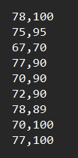
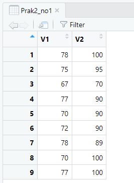
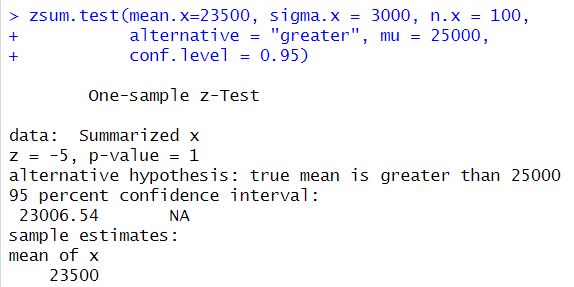
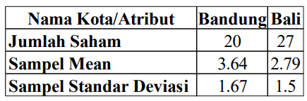
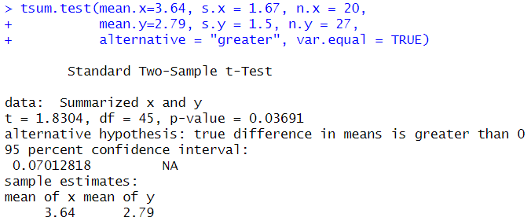
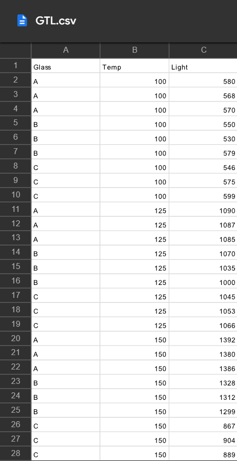
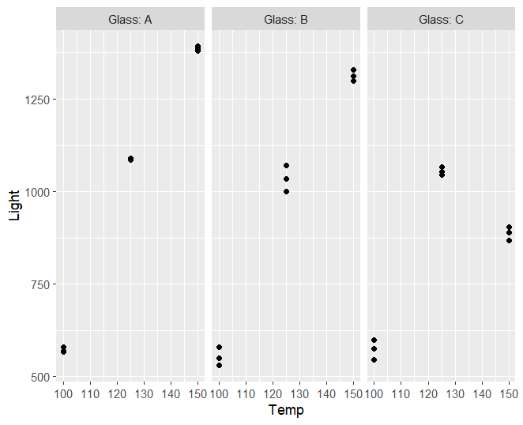
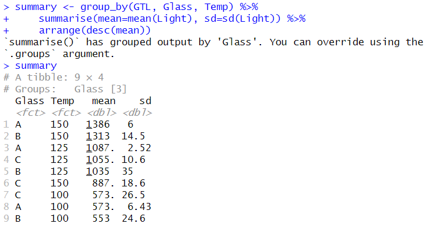

# Prak2_Probstat2023_C_5025211209
- Nama: Nizam Hakim
- NRP: 5025211209
- Kelas: Probstat C

## No 1
Seorang peneliti melakukan penelitian mengenai pengaruh aktivitas 𝐴 terhadap kadar saturasi oksigen pada manusia. Peneliti tersebut mengambil sampel sebanyak 9 responden. Pertama, sebelum melakukan aktivitas 𝐴, peneliti mencatat kadar saturasi oksigen dari 9 responden tersebut. Kemudian, 9 responden tersebut diminta melakukan aktivitas 𝐴. Setelah 15 menit, peneliti tersebut mencatat kembali kadar saturasi oksigen dari 9 responden tersebut. Berikut data dari 9 responden mengenai kadar saturasi oksigen 
sebelum dan sesudah melakukan aktivitas.

Tabel Pengamatan Saturasi Oksigen sebagai berikut:


Disimpan dalam csv file menjadi:



Kemudian import ke R Studio dan simpan dalam variabel data




### 1a. Carilah Standar deviasi dari data selisih pasangan pengamatan tabel diatas
```
sd(data$V2-data$V1)
```
Didapatkan hasil 7.838651


### 1b. Carilah nilai t (p-value)
```
t.test(data$V2, data$V1, paired=TRUE)
```
Menggunakan t-test didapatkan p-value sebesar 0.0001373


### 1c. Tentukanlah apakah terdapat pengaruh yang signifikan secara statistika dalam hal kadar saturasi oksigen , sebelum dan sesudah melakukan aktivitas 𝐴 jika diketahui tingkat signifikansi 𝛼 = 5% serta H0 : “tidak ada pengaruh yang signifikan secara statistika dalam hal kadar saturasi oksigen sebelum dan sesudah melakukan aktivitas 𝐴”.

Karena p-value `0.0001373` lebih kecil dibandingkan tingkat signifikansi 𝛼 `0,05` , maka null hypotesis (H0) ditolak dan alternative hypotesis (H1) diterima. Artinya terdapat pengaruh yang signifikan secara statistika dalam hal jumlah kadar saturasi oksigen sebelum dan sesudah melakukan aktivitas A.

## No 2
Diketahui bahwa mobil dikemudikan rata-rata lebih dari 25.000 kilometer per tahun. Untuk menguji klaim ini, 100 pemilik mobil yang dipilih secara acak diminta untuk mencatat jarak yang mereka tempuh. Jika sampel acak menunjukkan rata-rata 23.500 kilometer dan standar deviasi 3.000 kilometer (kerjakan menggunakan library seperti referensi pada modul).

### 2a.
Menggunakan zsum()
```
zsum.test(mean.x=23500, sigma.x = 3000, n.x = 100, 
          alternative = "greater", mu = 25000, 
          conf.level = 0.95)
```
Didapatkan hasil:



- H0 : μ ≥ 25000
- H1 : μ < 25000

Saya setuju dengan klaim pada soal karena dari perhitungan zsum() diatas didapatkan p-value = 1 dimana `p-value = 1 > α = 0,5` , artinya tidak cukup bukti untuk menolak H0 yaitu bahwa mobil dikemudikan rata-rata lebih dari 25.000 kilometer per tahun

### 2b.
Karena tidak cukup bukti untuk menolak H0 maka diambil kesimpulan bahwa mobil dikemudikan rata-rata lebih dari 25.000 kilometer per tahun

## No 3
Diketahui perusahaan memiliki seorang data analyst yang ingin memecahkan permasalahan pengambilan keputusan dalam perusahaan tersebut. Selanjutnya didapatkanlah data berikut dari perusahaan saham tersebut



Dari data di atas berilah keputusan serta kesimpulan yang didapatkan. Asumsikan nilai variancenya sama, apakah ada perbedaan pada rata-ratanya (α= 0.05)? 

### Buatlah:
### 3a. H0 dan H1
- H0 = tidakada perbedaan antara mean saham bandung dengan mean saham bali
- H1 = ada perbedaan antara mean saham bandung dengan mean saham bali

### 3b. Hitung sampel statistik
Menggunakan tsum dengan `var.equal = TRUE` karena asumsi soal variance kedua data sama
```
tsum.test(mean.x=3.64, s.x = 1.67, n.x = 20, 
          mean.y=2.79, s.y = 1.5, n.y = 27, 
          alternative = "greater", var.equal = TRUE)
```
Didapatkan hasil:



### 3c. Lakukan uji statistik (df=2)
Menggunakan plotDist dari package mosaic
```
plotDist(dist='t', df=2)
```
Didapatkan hasil:


### 3d. Nilai kritikal
Menggunakan qchisq untuk mencari nilai kritikal dengan confidence level 95% dan derajat kebebasan 2
```
qchisq(p = 0.05, df = 2, lower.tail = FALSE)
```
Didapatkan hasil 5.991465


### 3e. Keputusan
Karena p-value pada poin 3b = 0.03691 dan α = 0.05 maka 0.03691 < 0.05. Sehingga H0 ditolak dan H1 diterima

### 3f. Kesimpulan
Karena H1 diterima, artinya ada perbedaan antara mean saham bandung dengan mean saham bali `µ1 ≠ µ2`

## No 4
Data yang digunakan merupakan hasil eksperimen yang dilakukan untuk mengetahui pengaruh suhu operasi (100˚C, 125˚C dan 150˚C) dan tiga jenis kaca pelat muka (A, B dan C) pada keluaran cahaya tabung osiloskop. Percobaan dilakukan sebanyak 27 kali dan didapat data sebagai berikut:



Download dan import data ke dalam R Studio

### 4a. Buatlah plot sederhana untuk visualisasi data
Menggunakan qplot
```
qplot(x = Temp, y = Light, geom = "auto", data = GTL) + facet_grid(.~Glass, labeller = label_both)
```
Didapatkan hasil



### 4b. Lakukan uji ANOVA dua arah
Menggunakan fungsi aov() untuk menghitung anova dan summary() untuk menampilkan hasilnya
```
GTL$Glass <- as.factor(GTL$Glass)
GTL$Temp <- as.factor(GTL$Temp)

anova <- aov(Light ~ Glass*Temp, data = GTL)
summary(anova)
```
Didapatkan hasil:


### 4c. Tampilkan tabel dengan mean dan standar deviasi keluaran cahaya untuk setiap perlakuan (kombinasi kaca pelat muka dan suhu operasi)
Group by Glass, Temp untuk kombinasi perlakuan kaca pelat muka dan suhu operasi. Kemudian gunakan fungsi summarise()
```
summary <- group_by(GTL, Glass, Temp) %>%
    summarise(mean=mean(Light), sd=sd(Light)) %>%
    arrange(desc(mean))
summary
```
Didapatkan hasil:


